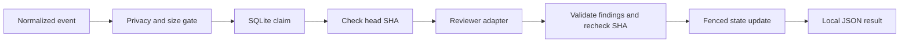

# GitLab MR Review Automation

An offline reference implementation of the hard parts around automated code review:
deduplication, commit freshness, retry limits, worker ownership, and finding validation.

Run a useful demo without a GitLab account, API key, database server, or dependency install.
Requires Python 3.11 or newer. [한국어 안내](README.ko.md)

```sh
python3 -m reviewflow demo
python3 -m unittest discover -s tests -v
```

The demo reviews one synthetic event twice. The first result is `completed` with
a structured-logging suggestion; the second is `duplicate`. The temporary database
is removed automatically. The reviewer is a deterministic test double, not an LLM.

## Why this exists

Repeated webhook delivery should not repeat expensive work. A force-push should
invalidate a review made against the old commit. A restarted process should retain
deduplication state. And a reviewer should not be able to attach a finding to a line
that was never in the supplied change set.

This repository makes those behaviors small enough to inspect and test.



## Use a local event

```sh
python3 -m reviewflow review examples/event.json \
  --head aaaaaaaaaaaaaaaaaaaaaaaaaaaaaaaaaaaaaaaa \
  --db review-state.sqlite3
```

Run it again with the same database to observe persistent deduplication. To exercise
the stale-commit path, use a new database path and a different 40-character SHA.
The example project, commit and source line are synthetic.

The input is a **normalized event**, not a raw GitLab webhook. `changes` maps relative
file paths to changed line numbers and single-line source text. The CLI converts JSON
line-number keys to integers and rejects duplicate keys and ambiguous line numbers.

| Exit code | Meaning |
| --- | --- |
| 0 | Completed or already completed |
| 1 | Busy, superseded, retryable, invalid review, failed, or lease lost |
| 2 | Invalid/blocked input or local storage failure |

## Implemented guarantees and boundaries

- One claim per project/MR/SHA while a lease is active, using a SQLite transaction.
- Conflicting change sets for the same identity are rejected by a stored digest.
- Three attempts maximum; only timeout and connection errors are retried.
- Expired claims can be reclaimed. An older attempt cannot finish a reclaimed job.
- Head SHA is checked before and after review. Superseded results contain no findings.
- Findings must refer to supplied changed lines and fit size/severity/privacy rules.
- Database state contains hashes, status, attempts and a lease deadline, not source text.
- Exception messages are not returned to callers.

The privacy gate is deliberately small: sensitive paths and selected credential
patterns. It is **not a comprehensive secret scanner**. A production adapter must
add an appropriate scanning and data-handling policy before sending source elsewhere.

## Adapter contract

`run_once(store, event, head, reviewer)` accepts two callables:

```python
from reviewflow.core import Event, Finding, Store, run_once

event = Event("example/service", 7, "a" * 40, {"app.py": {8: "print('hello')"}})
with Store("review-state.sqlite3") as store:
    result = run_once(
        store,
        event,
        head=lambda: "a" * 40,
        reviewer=lambda event: [Finding("app.py", 8, "warning", "Consider structured logging.")],
    )
```

Each worker/thread needs its own `Store` connection. The caller drives retries and
scheduling; there is no background queue or lease heartbeat. A killed worker can be
reclaimed after the default five-minute lease. Reviewers must enforce their own
execution timeout.

## Scope

No live webhook server, GitLab API client, Slack publisher, or LLM integration is
included. There is no external exactly-once delivery claim: completion records local
work, and results are printed locally. The final SHA check cannot eliminate a future
race at an external publisher; such an adapter needs its own reconciliation protocol.

`.env.example` documents placeholders for a future integration. The offline CLI does
not load it and does not request credentials. Never replace the example with real
values in version control.

The tests cover retry exhaustion, conflicting content, two-connection claims,
lease fencing, restarts, privacy, invalid finding locations and CLI failure output.
CI is configured for Python 3.11–3.13; a local test run is not evidence that hosted CI
has already run.

## Development

The implementation uses only the Python standard library. Keep a behavior change
paired with a regression test and keep provider-specific code outside the state machine.
See [security guidance](SECURITY.md). A distribution license has not yet been selected.
